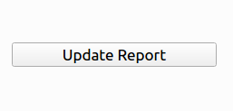

# Database-GUI
This is the GUI written in qt for python to access and analyse the databse of specific type.

## How to use
First install all the required packages and dependencies:-
```bash
$ python3 -m pip install -r requirements.txt
$ pip3 install -r requirements.txt
$ python3 -m pip install mysql-connector
```

now set-up the .env file as your system default environment variables.
```
# MySQL Config
MYSQL_HOST=""                               # like localhost
MYSQL_USER=""                               # like root
MYSQL_PASSWORD=""                           # your password
MYSQL_DB=""                                 # your default database
MYSQL_MAIN_TABLE=""                         # maybe in your case is "imsiall"
```
now run the `main.py` python file:-
```bash
$ python3 main.py
```

Now, click on update table method



New window will appear. Now, wait for some time to get the process finished completely.<br>
Now press `Quit button`(of that new window) and restart the script to get the required data numbers:-

```bash
$ python3 main.py
```
#### Using custom classifier method:-
<br>
Set the desired <b> from </b> and <b> To </b> date in the given column and click on `Get` button:-


Now wait for some time so that process will finish.

So now you will ve able to see the some numbers in the <b>`Custom Values`</b> column.


<br>

Click the buttons to get the all imsi no. list belonging to that particular catagory.
